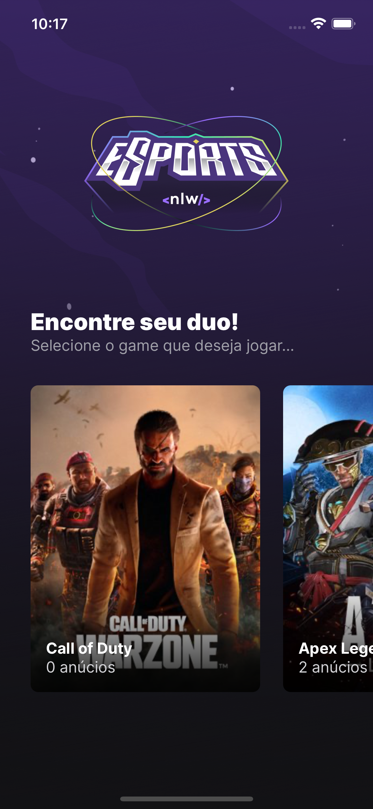
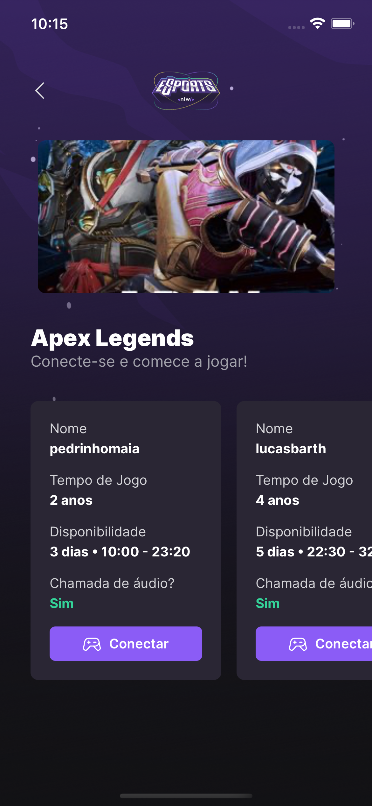
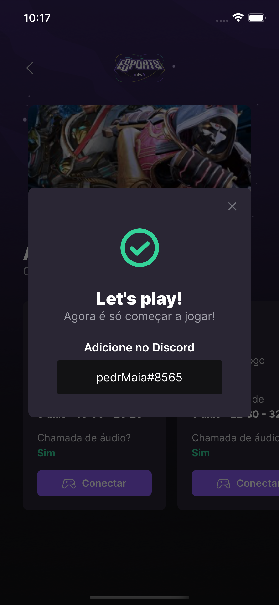

<h1>Esports NLW</h1>

 Olá, esse projeto foi desenvolvido no evento da Rocketseat chamado de NLW. Que tem como objetivo criar uma aplicação do zero utilizando as bibliotecas React JS e React Native. 

<h1>
    <a href="https://pt-br.reactjs.org/">🔗 React</a>
</h1>

🚀 Projeto que tem como objetivo juntar gamers do mundo todo para poder encontrar jogadores no qual poderão se conectar pelo discord.

<h1> 💻 Versão Web</h1>
<h3> Tela 1 </h3>

  É usada para ver os jogos no qual quer encontrar outro jogador para jogar  

<h3> Tela 2 </h3>

 O usuário cria um anúncio para o jogo escolhido onde preenche o formulário com as informações nome do jogo, nome(ou nickname), quantos anos joga, qual seu discord, quando costuma jogar, qual horário do dia e se costuma se conectar ao chat de voz. 
Ao criar anúncios, outros usuários poderão ver os anúncios criados no app. 
 

<h1> 📱 Versão Mobile</h1>
<h3> Tela 1 </h3>

  É usada para escolher os jogos no qual quer encontrar outro jogador para jogar. 

<h3> Tela 2 </h3>

 É onde ficam os anúncios criados pelos usuários onde poderá escolher qual jogador se encaixa melhor com você. 

<h3> Tela 3 </h3>

  Ao clicar no botão de se conectar aparecerá o nome do discord do jogador escolhido para copiar e encontrar ele no discord para marcar uma partida. 

