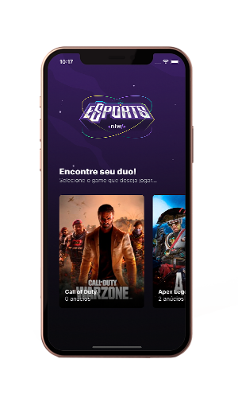
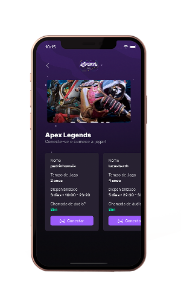
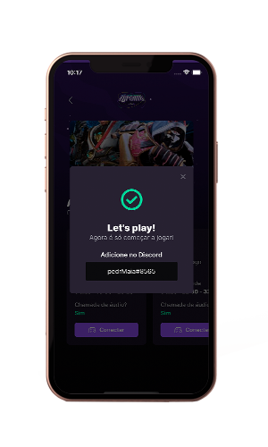

<h1>Esports NLW</h1>
<p> Olá, esse projeto foi desenvolvido no evento da Rocketseat chamado de NLW. Que tem como objetivo criar uma aplicação do zero utilizando as bibliotecas React JS e React Native. </p>

<h1>
    <a href="https://pt-br.reactjs.org/">🔗 React</a>
</h1>
<p>🚀 Projeto que tem como objetivo juntar gamers do mundo todo para poder encontrar jogadores no qual poderão se conectar pelo discord.</p>

<h1> 💻 Versão Web</h1>
<h3> Tela 1 </h3>
<p>  É usada para ver os jogos no qual quer encontrar outro jogador para jogar  </p>


<h3> Tela 2 </h3>
<p> O usuário cria um anúncio para o jogo escolhido onde preenche o formulário com as informações nome do jogo, nome(ou nickname), quantos anos joga, qual seu discord, quando costuma jogar, qual horário do dia e se costuma se conectar ao chat de voz. 
Ao criar anúncios, outros usuários poderão ver os anúncios criados no app. 
 </p>


<h1> 📱 Versão Mobile</h1>
<h3> Tela 1 </h3>
<p>  É usada para escolher os jogos no qual quer encontrar outro jogador para jogar. </p>


<h3> Tela 2 </h3>
<p> É onde ficam os anúncios criados pelos usuários onde poderá escolher qual jogador se encaixa melhor com você. </p>


<h3> Tela 3 </h3>
<p>  Ao clicar no botão de se conectar aparecerá o nome do discord do jogador escolhido para copiar e encontrar ele no discord para marcar uma partida. </p>



### Pré-requisitos

Antes de começar, você vai precisar ter instalado em sua máquina as seguintes ferramentas:
[Git](https://git-scm.com), [Node.js](https://nodejs.org/en/). 
Além disto é bom ter um editor para trabalhar com o código como [VSCode](https://code.visualstudio.com/)

### 🎲 Rodando o Back End (servidor)

```bash
# Clone este repositório
$ git clone <https://github.com/LucasHenriqueBarth/Nlw-eSports/>

# Acesse a pasta do projeto no terminal/cmd
$ cd NLW

# Vá para a pasta server
$ cd server

# Instale as dependências
$ npm install

# Execute a aplicação em modo de desenvolvimento
$ npm run dev 

# O servidor inciará na porta:3333 - acesse <http://localhost:3333>

```

### 🎲 Rodando o Front End (Aplicação)

```bash
# Abra outro terminal e acesse a pasta web 
$ cd web

# Instale as dependências
$ npm install

# Execute a aplicação em modo de desenvolvimento
$ npm run dev 

Para acessar Aplicação acesse <http://localhost:5173>

```


